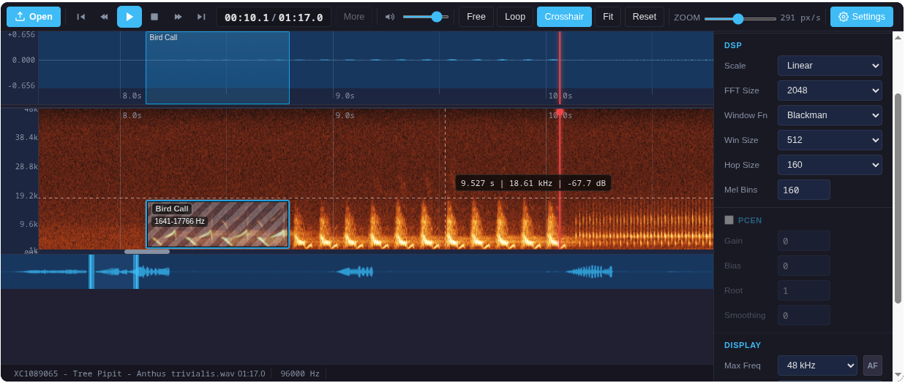

> ⚠️ **Early development — Unstable**
>
> This project is in active early development. APIs, features, and build artifacts may change or break without notice. You're encouraged to try it and provide feedback, but do not expect a stable release or backward compatibility yet. If you require stability, pin to a specific commit or wait for an official release. Contributions and bug reports are welcome.

# SignaVis

<p align="center">
  
</p>

<div align="center">
<table align="center" cellpadding="12" cellspacing="0" style="border:1px solid #e1e4e8;background:#f6f8fa;border-radius:6px;">
  <tr>
    <td align="center">
      <h3>💡 Try it — Demo</h3>
      <p>Interactive demo and a full labeling app (BirdNET detection &amp; annotation). Try them in your browser:</p>
      <p>
        <a href="https://limitlessgreen.github.io/SignaVis/"></a>
        <a href="https://limitlessgreen.github.io/SignaVis/demo/labeling-app.html?xcid=1"></a>
      </p>
      <p>
        <a href="https://github.com/LimitlessGreen/SignaVis/actions/workflows/ci.yml"></a>
        <a href="https://www.npmjs.com/package/signavis"></a>
        <a href="https://pypi.org/project/signavis/"></a>
        <a href="https://github.com/LimitlessGreen/SignaVis/blob/main/LICENSE"></a>
      </p>
    </td>
  </tr>
</table>
</div>

DAW-like audio player (waveform + spectrogram + transport controls) as a standalone library — built for bioacoustic analysis, annotation, and embedding.

## Table of contents

- [signavis](#signavis)
  - [Table of contents](#table-of-contents)
  - [Features](#features)
  - [Install](#install)
  - [Quickstart](#quickstart)
  - [Player Options](#player-options)
  - [Usage Examples](#usage-examples)
    - [ESM (Vite / Vanilla)](#esm-vite--vanilla)
    - [Load from URL](#load-from-url)
    - [File Input](#file-input)
    - [React](#react)
    - [Vue](#vue)
    - [Svelte](#svelte)
    - [CDN / IIFE](#cdn--iife)
    - [Streamlit (Python)](#streamlit-python)
    - [Jupyter Notebook](#jupyter-notebook)
  - [Demos](#demos)
  - [Python wrapper](#python-wrapper)
  - [Contributing](#contributing)
  - [License](#license)

## ✨ Highlights

- **Customizable spectrogram rendering** — adjust scale, contrast, gain, color mapping, and more
- **Synced waveform + spectrogram** with zoom and scroll
- **Label annotation** — draw, drag, resize, undo, redo
- **BirdNET suggestions** — accept or discard detections in one click
- **Xeno-canto integration** — search, import, and enrich recordings
- **Bandpass playback** — listen to specific frequency regions
- **Fast frequency zoom** — wheel, slider, and drag controls

## Install

```bash
npm i signavis
```

Note: signavis expects `wavesurfer.js` as a peer dependency (v7). Install it with:

```bash
npm i wavesurfer.js@^7
```

Or include `wavesurfer.js` from a CDN in the browser:

```html
<script src="https://unpkg.com/wavesurfer.js@7"></script>
```

Or for Python:

```bash
pip install signavis
```

See [PyPI](https://pypi.org/project/signavis) and the [python-wrapper/README.md](python-wrapper/README.md) for full Python usage.

## Quickstart
```js
import { BirdNETPlayer } from 'signavis'
import 'signavis/style'

const player = new BirdNETPlayer(document.getElementById('player'))
await player.ready
```
```bash
npm ci
npm run typecheck
npm test
npm run build
npm run build:css
# Inspect what would be published
npm pack --dry-run
```

Publishing via CI:

- The CI workflow runs on push and for tags; it publishes when a tag matching `v*` is pushed.
- To enable automatic publishing to npm, add an `NPM_TOKEN` secret in GitHub repository settings (Settings → Secrets → Actions → `NPM_TOKEN`).
- Create and push a semver tag to trigger a release:

```bash
git tag -a v0.3.1 -m "release v0.3.1"
git push origin v0.3.1
```


The release job will build artifacts, publish to npm and PyPI, and create a GitHub Release including built files.

How to create tokens & add GitHub secrets

- NPM (automation token): create an automation token on https://www.npmjs.com/settings/<your-username>/tokens (Create New Token → Automation). Copy the token and add it to your repository secrets as `NPM_TOKEN` (Settings → Secrets → Actions → New repository secret). You can also set it via the GitHub CLI:

```bash
gh secret set NPM_TOKEN --body 'PASTE_TOKEN_HERE' -R owner/repo
```

- PyPI: create an API token on https://pypi.org/manage/account/#api-tokens and add it as `PYPI_API_TOKEN` in repository secrets. The CI uses this secret when uploading the Python package.

Packaging notes:

- The package includes model files under `models/` (e.g., `models/birdnet-v2.4/`) — verify with `npm pack --dry-run`.

## Player Options

| Option | Type | Default | Description |
|---|---|---|---|
| `viewMode` | string | `'both'` | `'both'`, `'waveform'`, `'spectrogram'` — visible analysis views |
| `transportStyle` | string | `'default'` | `'default'`, `'hero'` — transport button style |
| `transportOverlay` | boolean | `false` | Centered play overlay, no toolbar height |
| `showFileOpen` | boolean | `true` | Show Open button and file input |
| `showTransport` | boolean | `true` | Show transport controls (play/pause/stop) |
| `showTime` | boolean | `true` | Show time display |
| `showVolume` | boolean | `true` | Show volume controls |
| `showViewToggles` | boolean | `true` | Show Follow/Loop/Fit/Reset buttons |
| `showZoom` | boolean | `true` | Show zoom slider |
| `showFFTControls` | boolean | `true` | Show FFT size, max frequency, color scheme |
| `showDisplayGain` | boolean | `true` | Show floor/ceiling sliders, auto contrast |
| `showStatusbar` | boolean | `true` | Show bottom status bar |
| `showOverview` | boolean | `true` | Show overview navigator |
| `showWaveformTimeline` | boolean | `true` | Show bottom timeline in waveform view |
| `compactToolbar` | string | `'auto'` | `'auto'`, `'on'`, `'off'` — responsive toolbar compaction |
| `labelTaxonomy` | array | see docs | Custom label presets (name, color, shortcut) |
| ... | ... | ... | ... |

See the [API section](#api) for usage examples and more details.

## Usage Examples

### ESM (Vite / Vanilla)
```js
import { BirdNETPlayer } from 'signavis'
import 'signavis/style'

const player = new BirdNETPlayer(document.getElementById('player'))
await player.ready
```

### Load from URL
```js
await player.loadUrl('/audio/birdsong.mp3')
player.play()
```

### File Input
```js
const input = document.querySelector('#audio')
input.addEventListener('change', async () => {
  const file = input.files?.[0]
  if (!file) return
  await player.loadFile(file)
})
```

### React
```jsx
import { useEffect, useRef } from 'react'
import { BirdNETPlayer } from 'signavis'
import 'signavis/style'

export default function Player() {
  const ref = useRef(null)
  useEffect(() => {
    if (!ref.current) return
    const p = new BirdNETPlayer(ref.current)
    return () => p.destroy()
  }, [])
  return <div ref={ref} />
}
```

### Vue
```js
import { onMounted, onBeforeUnmount, ref } from 'vue'
import { BirdNETPlayer } from 'signavis'
import 'signavis/style'

const root = ref(null)
let player

onMounted(() => { player = new BirdNETPlayer(root.value) })
onBeforeUnmount(() => player?.destroy())
```

### Svelte
```svelte
<script>
  import { onMount } from 'svelte'
  import { BirdNETPlayer } from 'signavis'
  import 'signavis/style'

  let el
  let player
  onMount(() => {
    player = new BirdNETPlayer(el)
    return () => player.destroy()
  })
</script>

<div bind:this={el}></div>
```

### CDN / IIFE
```html
<script src="https://unpkg.com/wavesurfer.js@7"></script>
<script src="https://unpkg.com/signavis/dist/birdnet-player.iife.js"></script>
<link rel="stylesheet" href="https://unpkg.com/signavis/dist/birdnet-player.css" />
<div id="player"></div>
<script>
  const player = new BirdNETPlayerModule.BirdNETPlayer(document.getElementById('player'))
</script>
```

### Streamlit (Python)
```python
from signavis import render_daw_player
import streamlit.components.v1 as components

components.html(render_daw_player(audio_bytes), height=620, scrolling=False)
```

### Jupyter Notebook
```python
from IPython.display import HTML
from signavis import render_daw_player

HTML(render_daw_player(audio_bytes))
```

## Demos

- **[Live Demo (GitHub Pages)](https://limitlessgreen.github.io/SignaVis/)** — component storybook with configurable stories
- **[Labeling App](https://limitlessgreen.github.io/SignaVis/demo/labeling-app.html?xcid=1)** — full-featured annotation tool with BirdNET detection, Xeno-canto integration, label management and spectrogram settings (`demo/labeling-app.html`)
- **[Google Colab Demo Notebook](https://colab.research.google.com/github/LimitlessGreen/SignaVis/blob/main/python-wrapper/demo_colab.ipynb) [](https://colab.research.google.com/github/LimitlessGreen/SignaVis/blob/main/python-wrapper/demo_colab.ipynb)**
- **Streamlit:**
  ```bash
  streamlit run python-wrapper/demo_streamlit.py
  ```
- **Gradio:**
  ```bash
  pip install gradio
  python python-wrapper/demo_gradio.py
  ```

## Python wrapper

The Python wrapper allows embedding the player in Streamlit, Jupyter, and Gradio. See [python-wrapper/README.md](python-wrapper/README.md) for full usage, options, and advanced features.

Install:
```bash
pip install signavis
```

Docs & PyPI: https://pypi.org/project/signavis

## Contributing

See the repository on GitHub and open issues/PRs: https://github.com/LimitlessGreen/SignaVis

## License

GNU AGPL-3.0
